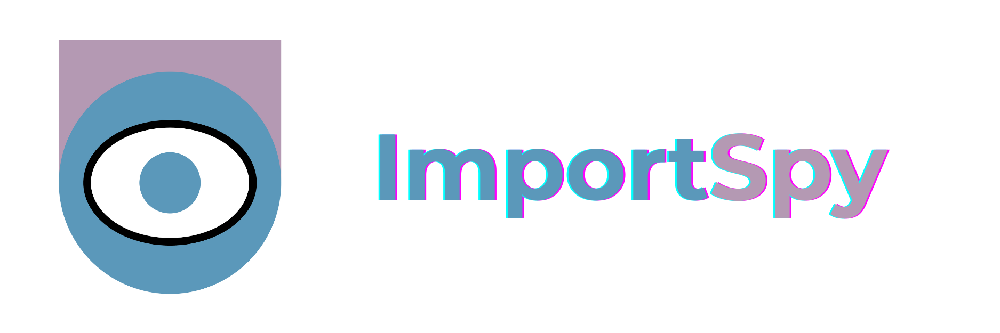

.. image:: https://img.shields.io/github/license/atellaluca/importspy
   :alt: License

.. image:: https://img.shields.io/pypi/v/importspy
   :target: https://pypi.org/project/importspy/
   :alt: PyPI Version

.. image:: https://img.shields.io/pypi/pyversions/importspy
   :alt: Supported Python Versions

.. image:: https://img.shields.io/github/actions/workflow/status/atellaluca/ImportSpy/python-package.yml
   :target: https://github.com/atellaluca/ImportSpy/actions/workflows/python-package.yml
   :alt: Build Status

.. image:: https://img.shields.io/readthedocs/importspy
   :target: https://importspy.readthedocs.io/
   :alt: Documentation Status

ImportSpy
=========

Contract-based import validation for Python modules.

*Runtime-safe, structure-aware, declarative.*

ImportSpy allows your Python modules to define explicit **import contracts**:  
rules about where, how, and by whom they can be safely imported — and blocks any import that doesn’t comply.

🔍 Key Benefits
---------------

- ✅ Prevent import from unsupported environments
- ✅ Enforce structural expectations (classes, attributes, arguments)  
- ✅ Control who can use your module and how  
- ✅ Reduce runtime surprises across CI, staging, and production  
- ✅ Define everything in readable `.yml` contracts

💡 Why ImportSpy?
-----------------

Python is flexible, but uncontrolled imports can lead to:

- 🔥 Silent runtime failures
- 🔍 Structural mismatches (wrong or missing methods/classes)
- 🌍 Inconsistent behavior across platforms
- 🚫 Unauthorized usage of internal code

ImportSpy offers you **runtime import governance** — clearly defined, enforced in real-time.

📐 Architecture Highlight
-------------------------

.. image:: https://raw.githubusercontent.com/atellaluca/ImportSpy/refs/heads/main/assets/importspy-spy-model-architecture.png
   :alt: ImportSpy, SpyModel Architecture
   :width: 830

ImportSpy uses a layered model (`SpyModel`) that mirrors your execution context and module structure:

- `Runtime` → defines architecture and system
- `System` → declares OS and environment variables
- `Python` → specifies interpreter, version, and modules
- `Module` → lists classes, functions, variables (each represented as objects, not dicts)

Each element is introspected and validated dynamically, at runtime or via CLI.

📜 Contract Example
-------------------

.. code-block:: yaml

   filename: plugin.py
   variables:
     - name: mode
       value: production
       annotation: str
   classes:
     - name: Plugin
       methods:
         - name: run
           arguments:
             - name: self
             - name: data
               annotation: dict
           return_annotation: None

📦 Installation
---------------

.. code-block:: bash

   pip install importspy

✅ Requires Python 3.10+

🔒 Usage Modes
--------------

**Embedded Mode** – the module protects itself:

.. image:: https://raw.githubusercontent.com/atellaluca/ImportSpy/refs/heads/main/assets/importspy-embedded-mode.png
   :alt: How ImportSpy Embedded Mode Works
   :width: 830

.. code-block:: python

   from importspy import Spy
   importer = Spy().importspy(filepath="spymodel.yml")
   importer.Plugin().run()

**CLI Mode** – validate externally in CI/CD:

.. image:: https://raw.githubusercontent.com/atellaluca/ImportSpy/refs/heads/main/assets/importspy-works.png
   :alt: How ImportSpy CLI Mode Works
   :width: 830

.. code-block:: bash

   importspy -s spymodel.yml -l DEBUG path/to/module.py

📚 Features Overview
--------------------

- ✅ Runtime validation based on import contracts  
- ✅ YAML-based, declarative format  
- ✅ Fine-grained introspection of classes, functions, arguments  
- ✅ OS, architecture, interpreter matching  
- ✅ Full error messages, CI-friendly output  
- ✅ Supports embedded or external enforcement  
- ✅ Strong internal model (`SpyModel`) powered by `pydantic`

🚀 Ideal Use Cases
------------------

- 🛡️ Security-sensitive systems (finance, IoT, medical)  
- 🧩 Plugin-based architectures (CMS, CLI, extensions)  
- 🧪 CI/CD pipelines with strict integration rules  
- 🧱 Frameworks with third-party extension points  
- 📦 Package maintainers enforcing integration rules

🧠 How It Works
---------------

1. Define your contract in `.yml` or Python.  
2. ImportSpy loads your module and introspects its importer.  
3. Runtime environment + structure are matched against the contract.  
4. If mismatch → import blocked.  
   If valid → import continues safely.

🎯 Tech Stack
-------------

- ✅ Pydantic 2.x – contract validation engine  
- ✅ Typer – CLI interface  
- ✅ ruamel.yaml – YAML parsing  
- ✅ inspect + sys – runtime context introspection  
- ✅ Poetry – package + dependency management  
- ✅ Sphinx + ReadTheDocs – full docs and architecture reference

📘 Documentation
----------------

- 🔗 Full Docs → https://importspy.readthedocs.io/  
- 🧱 Model Overview → https://importspy.readthedocs.io/en/latest/advanced/architecture_index.html  
- 🧪 Use Cases → https://importspy.readthedocs.io/en/latest/overview/use_cases_index.html

🌟 Contribute & Support
-----------------------

- ⭐ Star → https://github.com/atellaluca/ImportSpy  
- 🛠 Contribute via issues or PRs  
- 💖 Sponsor → https://github.com/sponsors/atellaluca  

🔥 **Let your modules enforce their own rules.**  
Start importing with structure.

📜 License
----------

MIT © 2024 – Luca Atella

**ImportSpy** is an open-source project maintained with ❤️ by `Luca Atella <https://www.linkedin.com/in/luca-atella/>`_.
