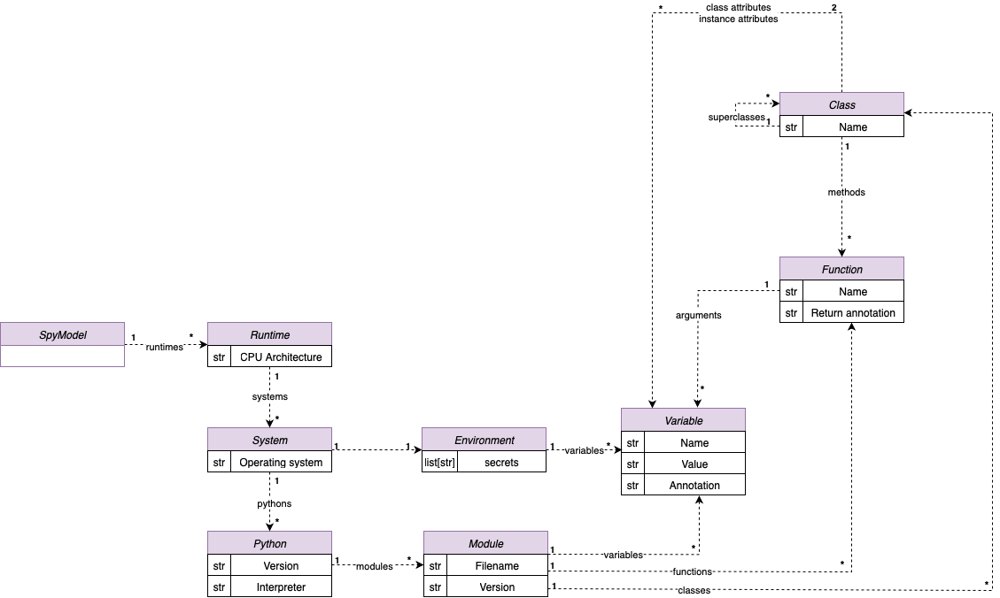

# SpyModel Architecture

The **SpyModel** is the central object in ImportSpy's validation model.  
It represents both the structural definition of a Python module and the contextual constraints under which the module can be imported and executed.

This hybrid role makes it a bridge between the static world of code structure and the dynamic world of runtime validation.

---

## Overview

ImportSpy introduces the concept of **import contracts**: structured `.yml` files that describe how a Python module is expected to behave, what it provides, and where it is valid.

The SpyModel is the object-oriented representation of these contracts. It is composed of two main aspects:

- **Structural metadata**: variables, functions, classes, attributes, and type annotations
- **Deployment constraints**: supported architectures, operating systems, interpreters, Python versions, environment variables, and secrets

This combination allows precise control over when and where a module can be imported.

---

## Structural Layer

The structural part of a SpyModel describes the internal shape of the Python module:

- **filename**: the name of the `.py` file
- **variables**: global variables defined at module level, including optional type and value
- **functions**: standalone functions, with argument names, types, and return annotations
- **classes**: including attributes (class-level and instance-level), methods, and inheritance

Each of these elements is validated against what the contract expects.  
This ensures that a module importing another can rely on a well-defined structure.

---

## Deployment Layer

The second part of the model defines where and under which conditions the module is considered valid.

This is handled by the `deployments` field, a list of accepted runtime configurations.  
Each deployment includes:

- **arch**: CPU architecture (e.g., `x86_64`, `ARM`)
- **systems**: operating systems supported (`linux`, `windows`, `macos`)
  - Each system includes:
    - **environment**:
      - **variables**: required environment variables and their expected values
      - **secrets**: variable names that must exist, without checking their value
    - **pythons**: accepted Python interpreters and versions, each with:
      - a list of expected **modules**, including their own structure

This allows defining highly specific constraints such as:

- “This plugin can only be used on Linux x86_64 with Python 3.12.9”
- “This module requires `MY_SECRET_KEY` to be present in the environment”

---

## Schema Overview

The following UML diagram summarizes the structure of the SpyModel and its relationships:

Each node represents a data structure used during validation.  
The model is hierarchical: from deployments down to classes and attributes, every element is traceable and verifiable.

---

## Design Rationale

The SpyModel is designed to be:

- **Declarative**: the contract is expressed in data, not code logic
- **Versionable**: stored as YAML, the contract can be committed to Git
- **Composable**: it supports multiple deployment targets and alternative environments
- **Predictable**: ensures that structural mismatches are detected early

By separating structure from logic, ImportSpy enables a contract-driven development workflow.  
This is particularly useful in plugin frameworks, controlled environments, or distributed systems where consistency across modules and contexts is critical.

---

ImportSpy treats contracts as **first-class citizens**. The SpyModel is the embodiment of this philosophy: a transparent, enforceable, and structured declaration of what a module requires and provides.
