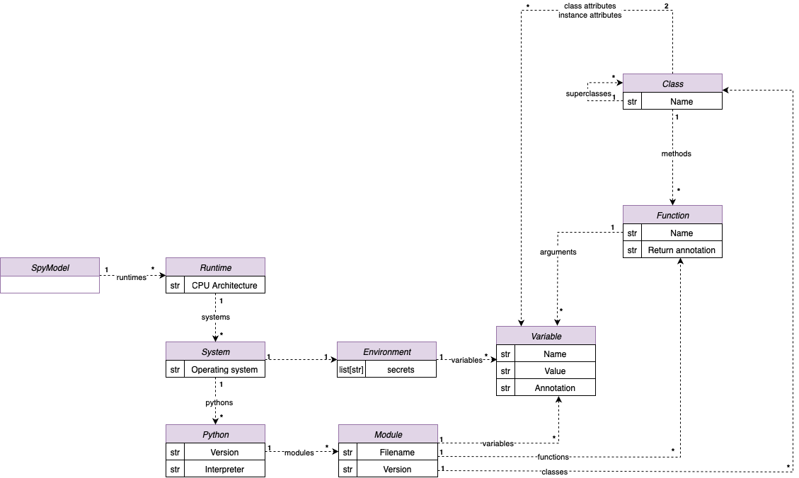

# Contract and runtime models

`AdmissionPolicy` is the contract model for 0.5 admission. It extends the existing
`SpyModel` fields so source structure, host runtime, dependency rules, and evidence
requirements share one validated YAML vocabulary.

```text
AdmissionPolicy
├── SpyModel structure: filename, version, variables, functions, classes
├── legacy deployments: architecture → systems → Python → module constraints
├── schema_version, policy_id
├── runtime
├── dependencies, dependency_options
└── evidence_requirements
```

Use [contract syntax](../contracts/syntax.md) for field definitions and
[architecture](../architecture.md) for the collection/evaluation pipeline.

## Structural models

`Module`, `Variable`, `Argument`, `Function`, `Attribute`, and `Class` describe
requirements. Optional fields impose constraints only when requested; supported
values remain scalars. Annotation strings can represent user-defined and
parameterized types without evaluating them. All nested contract models reject
unknown fields so misspellings cannot silently remove a constraint.

Static inspection produces separate source facts, including explicit unknowns.
Those facts are compared with the contract; they are not runtime module objects.
An `AdmissionDecision` contains the resulting evidence, inventory, and violations.

## Legacy runtime snapshots

`SpyModel.from_module(module)` inspects an already loaded module. It does not
reload or unregister it, and exposes structure directly as well as through the
legacy deployment hierarchy. Runtime inspection may invoke dynamic Python
attributes. It is suitable only for already admitted, trusted modules and does
not provide the static no-execution boundary.

The snapshot contains host environment values in memory for legacy comparisons.
Do not publish it as an admission report. Use `AdmissionDecision` and its
reporters for the 0.5 workflow.

The previous SpyModel diagram remains a historical reference for the legacy
hierarchy; it does not describe the complete 0.5 engine:



Read [migration from 0.4](../migration-0.5.md) for strict field validation,
annotation changes, and the `Spy.importspy` deprecation.
