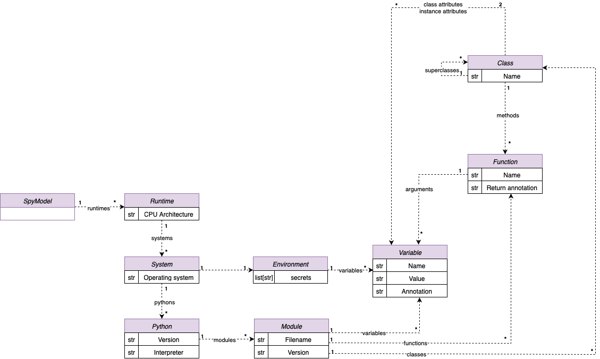

# ImportSpy

**Context-aware import validation for Python modules**

ImportSpy is an open-source Python library that introduces a robust mechanism to control and validate how and when modules are imported. At its core, it relies on versioned, declarative **import contracts** — written in YAML — which describe what a module expects from its execution context and its importer.

It brings **modularity**, **predictability**, and **security** to Python ecosystems.

---

## What is an Import Contract?

An import contract is a `.yml` file that defines:

- The expected **structure** of a module: functions, classes, arguments, annotations, variables
- The allowed **environments**: OS, architecture, Python version, interpreter
- Optional conditions on runtime **environment variables** or **superclasses**

If these conditions are not met, ImportSpy can stop the import and raise a detailed, structured error — before any runtime failure can occur.

---

## Key Features

- YAML-based **import contracts**
- Embedded and CLI-based **validation**
- Structural validation of **variables**, **functions**, **classes**
- Runtime checks for **OS**, **architecture**, **Python version**, **interpreter**
- Contract-driven plugin validation for **secure extensibility**
- Clear, explainable **error reporting** on mismatch, missing, or invalid usage
- Fully integrable in **CI/CD pipelines**

---

## Use Cases

ImportSpy is built for teams that need:

- **Plugin-based architectures** with strict interface enforcement
- **Runtime protection** against incompatible environments
- Early validation in **DevSecOps** or **regulatory** pipelines
- Defensive boundaries between **internal components**
- **Automated structure verification** during deployment

---

## Example: Embedded Mode

```python
from importspy import Spy

caller = Spy().importspy(filepath="contracts/spymodel.yml")
caller.MyPlugin().run()
```

---

## Example: CLI Mode

```bash
importspy src/mymodule.py -s contracts/spymodel.yml --log-level DEBUG
```

---

## Project Structure

ImportSpy is built around 3 key components:

- `SpyModel`: represents the structural and runtime definition of a module
- `Spy`: the validation engine that compares real vs expected modules
- `Violation System`: formal system for raising errors with human-readable messages

---

## Documentation Overview

### 👣 Get Started

- [Quickstart](intro/quickstart.md)
- [Install](intro/install.md)
- [Overview](intro/overview.md)

### ⚙️ Modes of Operation

- [Embedded Mode](modes/embedded.md)
- [CLI Mode](modes/cli.md)

### 📄 Import Contracts

- [Contract Syntax](contracts/syntax.md)
- [SpyModel Specification](advanced/spymodel.md)

### 🧠 Validation Engine

- [Violation System](advanced/violations.md)
- [Contract Violations](errors/contract_violations.md)
- [Error Table](errors/error_table.md)

### 📦 Use Cases

- [Plugin-based Architectures](use_cases/index.md)

### 📘 API Reference

- [API Docs](api-reference.md)

### 🤝 Contributing

- [Contributing Guidelines](../CONTRIBUTING.md)
- [Security Policy](../SECURITY.md)
- [License (MIT)](../LICENSE)

---

## Architecture Diagram



---

## Why ImportSpy?

Python’s import system is powerful, but not context-aware. ImportSpy solves this by adding a **layer of structural governance** and **runtime filtering**.

This makes it ideal for:

- Plugin systems
- Isolated runtimes
- Package compliance
- Security-aware applications
- CI enforcement of expected module interfaces

---

## Sponsorship & Community

If ImportSpy is useful in your infrastructure, help us grow by:

- [Starring the project on GitHub](https://github.com/your-org/importspy)
- [Becoming a GitHub Sponsor](https://github.com/sponsors/your-org)
- [Contributing modules, tests, or docs](../CONTRIBUTING.md)

---

> ImportSpy is more than a validator — it's a contract of trust between Python modules.
